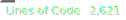

# Kaii Compiler


## Overview
Kaii is a statically typed, compiled programming language built entirely from scratch in C as part of the Inokaii ecosystem.
The project focuses on predictable compilation behavior, robust type enforcement, and memory-safe language semantics through explicit typing and controlled allocation patterns.

Kaii currently compiles source code into C and then builds native binaries, providing a transparent and debuggable compilation pipeline while preserving strong compiler engineering fundamentals.

## Current Features (Stage 2 Completed)
- Zero-copy Lexer and Abstract Syntax Tree (AST).
- Recursive Descent Parser with strict mathematical operator precedence.
- Semantic Analysis and Symbol Table enforcing mandatory explicit typing (`i32`, `f32`, class types, etc.).
- Code Generation (transpiler to C) with automated binary compilation.
- Memory Management (`alloc` / `free`) and Control Flow (`if` / `else`).

## Architecture Snapshot
- Frontend: hand-written lexer + recursive descent parser.
- Midend: semantic validation with symbol table-backed type checks.
- Backend: C code emission and host compiler invocation.
- Design principle: zero-copy token/lexeme handling wherever possible.

## Quick Start

### 1. Build the compiler
```bash
gcc src/main.c src/lexer/lexer.c src/parser/ast.c src/parser/parser.c src/codegen/codegen.c src/semantics/symbol_table.c src/utils/file_io.c -I src/ -o bin/kaic
```

### 2. Run a Kaii script
```bash
./bin/kaic build test/math.kaii
```

## Syntax Example
```kaii
fn main(): i32 {
	a: i32 = 10 + 5 * 2;
	b: f32 = 3.5;

	if (a > 20) {
		print("a is greater than 20");
	} else {
		print("a is 20 or less");
	}

	return 0;
}
```

## What's Next (Stage 3)
- `while` loop support with full semantic validation and code generation.
- Function system expansion with richer parameter handling and return-path analysis.
- Array support in syntax, type checking, and generated C output.

## Project Goals
- Deliver a production-grade educational compiler codebase in pure C.
- Keep the pipeline explicit, inspectable, and systems-focused.
- Evolve Kaii into a robust language foundation inside the Inokaii ecosystem.
